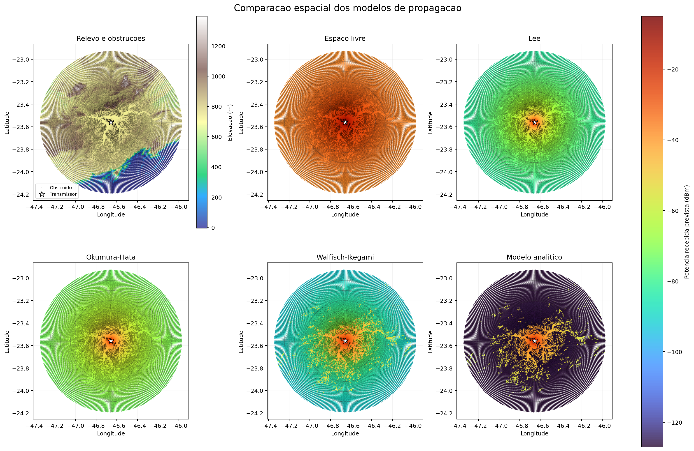

# RF Propagation Terrain Analysis

Python-based analysis of **radio-frequency propagation over real terrain**, combining geospatial data, elevation profiles and multiple propagation models to study signal attenuation around a broadcasting transmitter.

The project was originally developed for a **Telecommunications Projects** course. The study case uses a **Record TV broadcasting transmitter in São Paulo, Brazil**, with terrain profiles generated around the transmitting site and evaluated using different RF propagation models.

## Coverage Visualization



The visualization compares terrain elevation and predicted received signal power for all implemented propagation models using a common dBm scale.

It also displays:

* terrain elevation;
* obstructed propagation points;
* transmitter position;
* distance rings;
* spatial variation of predicted signal strength.

## Project Context

The objective of the project was to investigate how **terrain elevation and obstructions affect radio signal propagation** around a real broadcasting transmitter.

The geographic study area was initially prepared with **QGIS**.

A set of radial paths was generated around the transmitter, covering directions from approximately:

```text
1° → 360°
```

Each radial extended approximately:

```text
70 km
```

with terrain samples taken approximately every:

```text
30 m
```

The geographic coordinates were then enriched with elevation information and processed into terrain profiles used by the propagation models.

## Processing Pipeline

```text
QGIS
  │
  ├── Study area definition
  └── Radial path generation
          │
          ▼
Geographic coordinates
          │
          ▼
Elevation data
          │
          ▼
GPX / TXT data
          │
          ▼
Profile normalization
          │
          ▼
Terrain elevation profiles
          │
          ▼
Line-of-sight / obstruction analysis
          │
          ▼
RF propagation models
          │
          ├── Free Space
          ├── Lee
          ├── Okumura-Hata
          ├── Walfisch-Ikegami
          └── Analytical model
          │
          ▼
Received power estimation
          │
          ▼
Spatial comparison and visualization
```

## Technologies

* Python
* NumPy
* pandas
* Matplotlib
* Google Maps API
* QGIS
* GIS / geospatial processing
* RF propagation modeling
* terrain elevation analysis

## Propagation Models

Five propagation approaches are implemented.

### Free-Space Path Loss

Represents an ideal propagation environment without terrain or structural obstacles.

It provides a useful baseline for comparison with models that account for more realistic propagation conditions.

### Lee Model

Empirical propagation model used to estimate received signal levels in urban environments.

The implementation includes configurable reference parameters stored with the study configuration.

### Okumura-Hata

Empirical model commonly used for terrestrial radio propagation studies in urban environments.

The implementation evaluates signal attenuation according to transmitter height, receiver height, frequency and propagation distance.

### Walfisch-Ikegami

Model intended for urban propagation scenarios involving buildings and diffraction.

> **Important:** for the parameters used in this study, the current scenario falls outside the recommended validity range of the Walfisch-Ikegami model. It is retained for comparative and experimental purposes rather than treated as a validated prediction for this specific case.

### Analytical Model

A custom analytical implementation used as an additional comparison against the empirical propagation models.

## Study Parameters

The main study parameters are centralized in:

```text
scripts/models/study_parameters.py
```

Current values include:

| Parameter                    |    Value |
| ---------------------------- | -------: |
| Antenna height               | 155.98 m |
| Transmitter ground elevation |  825.8 m |
| Receiver height              |    9.1 m |
| Transmitter power            | 15,000 W |
| Frequency                    |  509 MHz |
| Receiver gain                | 2.15 dBi |
| Transmitter gain             | 9.29 dBd |
| Maximum profile distance     | 69,960 m |
| Profile sampling interval    |     30 m |

Keeping these parameters separate from the propagation algorithms makes it easier to reuse the processing pipeline for another transmitter or study area.

## Terrain and Obstruction Analysis

Terrain elevation is not treated only as visualization data.

The processing pipeline evaluates the geometry between transmitter and receiver points and identifies terrain that interferes with the expected propagation path.

The corrected implementation:

* treats the transmitter as `distance_m = 0`;
* uses the maximum profile distance at the receiver;
* uses the receiver height defined in the shared study parameters;
* evaluates terrain obstruction using the maximum terrain angle between transmitter and receiver;
* normalizes profile headers before consolidating results.

## Received Power

The propagation models calculate predicted received power using parameters such as:

* transmitter power;
* transmitter antenna gain;
* receiver gain;
* frequency;
* distance;
* propagation-model path loss;
* terrain-related conditions.

Transmitter gain specified in dBd is converted to dBi using the standard offset used by the implementation.

## Project Structure

```text
rf-propagation-terrain-analysis/
├── data/
│   ├── raw/
│   ├── intermediate/
│   ├── processed/
│   ├── selected/
│   └── auxiliary/
│
├── docs/
│   └── project_inventory.md
│
├── results/
│
├── scripts/
│   ├── models/
│   │   ├── modelo_analitico.py
│   │   ├── modelo_espaco_livre.py
│   │   ├── modelo_hata.py
│   │   ├── modelo_lee.py
│   │   ├── modelo_walfish_ikegami.py
│   │   └── study_parameters.py
│   │
│   ├── processing/
│   │   ├── process_txt_profiles.py
│   │   └── recalculate_obstructions.py
│   │
│   ├── results/
│   │   └── coverage_comparison.png
│   │
│   ├── visualize_coverage.py
│   └── README.md
│
├── .env.example
├── .gitignore
├── requirements.txt
└── README.md
```

## Installation

Clone the repository:

```bash
git clone https://github.com/DanielMartinez2/rf-propagation-terrain-analysis.git
cd rf-propagation-terrain-analysis
```

Create a virtual environment:

```bash
python -m venv .venv
```

Activate it.

### Windows PowerShell

```powershell
.\.venv\Scripts\Activate.ps1
```

### Linux / macOS

```bash
source .venv/bin/activate
```

Install the dependencies:

```bash
pip install -r requirements.txt
```

The project currently depends on:

```text
pandas
numpy
googlemaps
matplotlib
```

## Google Maps API Key

Some data-selection workflows can request elevation information using the Google Maps API.

The API key is **not stored in the source code**.

Set:

```text
GOOGLE_MAPS_API_KEY
```

before running the corresponding script.

### PowerShell

```powershell
$env:GOOGLE_MAPS_API_KEY="your_api_key"
```

### Windows CMD

```cmd
set GOOGLE_MAPS_API_KEY=your_api_key
```

The repository includes:

```text
.env.example
```

as a reference for environment configuration.

## Running the Analysis

The active processing pipeline is located inside `scripts/`.

From that directory, run the profile processing:

```bash
python processing/process_txt_profiles.py
```

Recalculate terrain obstructions:

```bash
python processing/recalculate_obstructions.py
```

Then execute the propagation models:

```bash
python models/modelo_espaco_livre.py
python models/modelo_lee.py
python models/modelo_hata.py
python models/modelo_walfish_ikegami.py
python models/modelo_analitico.py
```

Finally, generate the spatial comparison:

```bash
python visualize_coverage.py
```

The visualization is generated as:

```text
scripts/results/coverage_comparison.png
```

## Coverage Visualization Script

`visualize_coverage.py` consolidates the outputs produced by the five propagation models.

It:

* loads each model result with pandas;
* identifies the transmitter location;
* limits data to the study area;
* optionally downsamples the dataset for visualization;
* displays terrain elevation;
* identifies obstructed locations;
* draws distance rings;
* plots predicted received power;
* applies the same dBm scale across all five models;
* exports the complete comparison to PNG.

The sampling density can be changed with:

```bash
python visualize_coverage.py --stride 6
```

A custom output path can also be provided:

```bash
python visualize_coverage.py --output results/my_comparison.png
```

## Relationship to GPX Data Extractor

The GPX-to-text conversion stage used in this project eventually evolved into a separate reusable tool:

[GPX Data Extractor](https://github.com/DanielMartinez2/gpx-data-extractor)

That repository isolates and modernizes the GPX/XML parsing stage, while this project focuses on the complete telecommunications analysis workflow.

## Engineering Improvements

The original academic implementation was later reviewed and reorganized for reproducibility and clearer separation of responsibilities.

Improvements include:

* centralized study parameters;
* corrected transmitter-to-receiver distance handling;
* consistent receiver height across processing stages;
* improved terrain-obstruction calculation;
* consistent transmitter and receiver gain handling;
* explicit dBd-to-dBi conversion;
* normalized dataset headers;
* separation of processing and propagation models;
* environment-based API-key handling;
* reproducible result generation;
* comparative spatial visualization.

## What This Project Demonstrates

This project demonstrates practical experience with:

* Python scientific programming;
* telecommunications engineering;
* RF propagation;
* mathematical and empirical propagation models;
* geospatial data processing;
* QGIS-based GIS workflows;
* elevation-profile processing;
* terrain obstruction analysis;
* signal path-loss calculations;
* pandas and NumPy;
* Matplotlib data visualization;
* API integration;
* structured data pipelines;
* reproducible engineering analysis.

## Possible Improvements

Future development could include:

* interactive coverage maps;
* GeoJSON or GIS-layer export;
* automatic QGIS layer generation;
* comparison with measured field-strength data;
* statistical error analysis between models;
* Fresnel-zone visualization;
* additional propagation models;
* automatic transmitter configuration files;
* command-line execution of the complete pipeline;
* automated tests for propagation calculations;
* Jupyter notebooks for exploratory analysis;
* a web interface for comparing coverage models.

## Academic Context

This project originated as an academic telecommunications study in which each student selected a broadcasting installation and analyzed radio propagation around it.

The selected case was a **Record TV transmitter in São Paulo, Brazil**.

The project combined GIS preparation, terrain elevation data, Python processing and RF propagation theory to evaluate how distance and terrain characteristics influence predicted received signal levels.

## Author

**Daniel Martínez Alencar Freitas**

GitHub: [DanielMartinez2](https://github.com/DanielMartinez2)
